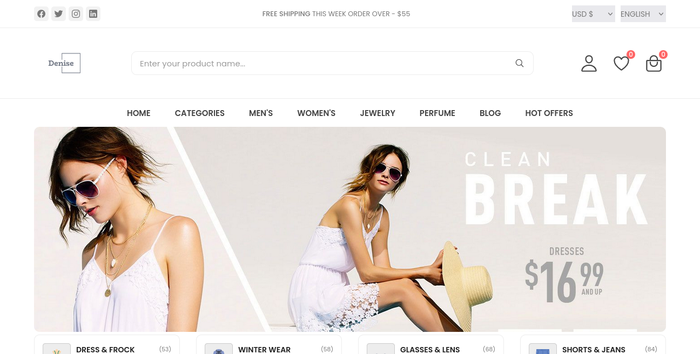
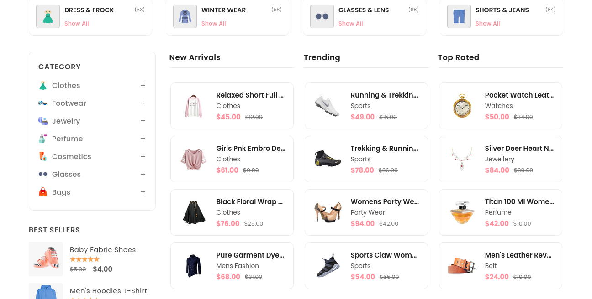
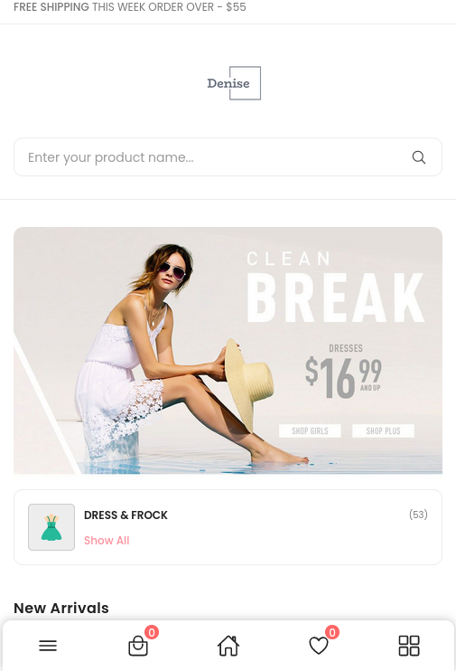
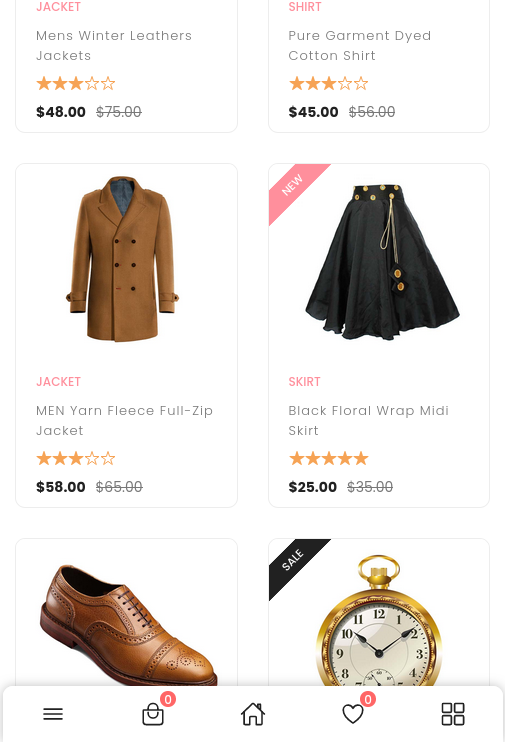

# Fashion eCommerce Website

Sample fashion e-commerce built with HTML, CSS, Javascript.

## Demo







## Prerequisites

Before you begin, ensure you have met the following requirements:

* [Git](https://git-scm.com/downloads "Download Git") must be installed on your operating system.

## Installing

Linux and macOS:

```bash
sudo git clone https://github.com/codewithsadee/anon-ecommerce-website.git
```

Windows:

```bash
git clone https://github.com/codewithsadee/anon-ecommerce-website.git
```

## License

This project is **free to use** and does not contains any license.
